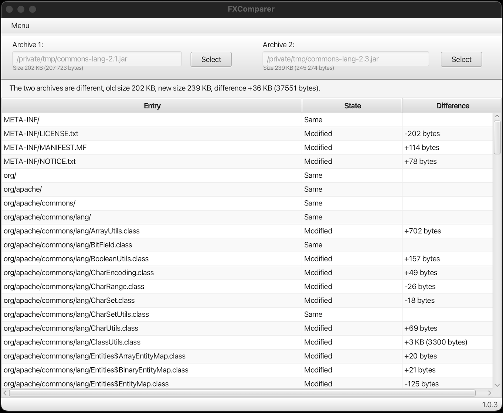

# FXComparer



FXComparer is a JavaFX desktop application that allows users to compare the contents of two archive files (such as ZIP, JAR, or other supported formats). The application provides a user-friendly interface to visualize differences between archives through intuitive file comparison.

## Features

- **Dual Archive Selection**: Load two archive files either through file selection dialogs or by drag-and-drop functionality
- **Visual Comparison**: View differences in a clear, tabular format with color-coded status indicators
- **Multiple Views**: See file entries categorized as:
  - New (files present only in the second archive)
  - Removed (files present only in the first archive)
  - Modified (files present in both archives but with different content)
  - Same (files present in both archives with identical content)
- **Detailed Information**: View file size differences and comprehensive archive statistics
- **User-Friendly Interface**: Intuitive JavaFX UI with drag-and-drop support for easy file loading

## Supported Archive Formats

FXComparer supports various archive formats through Apache Commons Compress, including but not limited to:
- ZIP/JAR files
- TAR archives
- Other common compression formats

## How to compile and run

```bash
mvn compile javafx:run
```

## How to build a distributable package

```bash
mvn clean package
```

This creates an executable JAR file in the `target` directory.

## Requirements

- Java 8 or higher
- Maven for building
- Tested with OpenJDK 21.0.5 2024-10-15 LTS

## Usage

1. Start the application using the run command above
2. Select two archive files using either:
   - The "Select" buttons to open file dialogs
   - Drag and drop files onto the designated areas in the UI
3. View the comparison results in the main table, which shows:
   - File entries from both archives
   - Status of each entry (New, Removed, Modified, Same)
   - Size differences where applicable
4. Use the menu to clear the current comparison or access additional options

---

*Originally exported from code.google.com/p/fx-comparer*